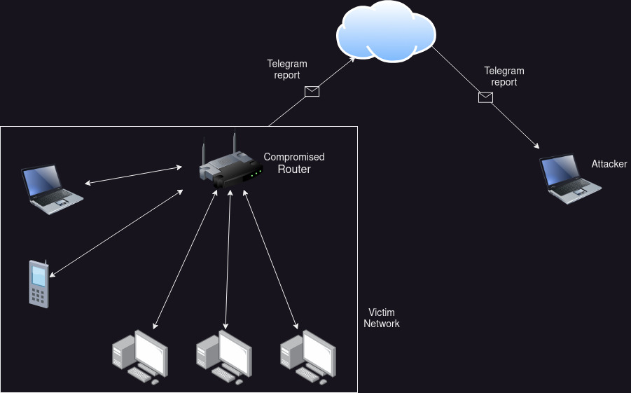

# d0raSpy - Spy Router Tool

 

## Wath is?
Inspired by the CIA's Top Secret projects revealed by Wikileaks:
- Project Elsa
- Project OutlawCountry
- Project Cherry Blossom
- Project Dumbo

## Features

| Features | |                                 
| --------- | --------- |
| Get public ip | ✔️ |
| Find all devices | ✔️ |
| Intercept all traffic | ✔️ |
| Send report to attacker| ✔️ |
| Get system info | ✔️ |
| Self-removal | ✔️ |
| Schedule Reverse shell | ✔️ |
| Enable port forwarding | ✔️ |
| Dump Shadow Passwords | ✔️ |
| DNS poisoning | ✔️ |
| Session control | ✔️ |
| System encryption | ✔️ |
| Deny connection | ✔️ |
| Upload customized firmware | ❌ |
| Session hijack | ❌ |
| Script injection | ❌ |
| Packet forger | ❌ |
| Traffic manipulation | ❌ |
| Clear System Log | ❌ |
| OnionShare support | ❌ |
| Secret admin HTML page | ❌ |

## Supported Devices
The scripts were written in bash and tested on a Raspberry Pi 4B with OpenWrt, so they should work for most routers on the market. 

If you look like to test it and install OpenWrt on Raspberry, follow this guide:

https://www.ixonae.com/configure-a-raspberry-pi-as-a-secure-wifi-access-point-with-open-wrt/

## How setup the Bot Telegram

1. Open `Telegram` > search `BotFather` > type `/newbot` > set name `name_bot` > `get HTTP API token` 
2. Search `RawDataBot` > Click `Start` > The Telegram bot will send a message with your account info. Scroll down and find chat. Your `chat ID` number is listed below, next to id

## Obfuscation
It is not possible to make a bash file completely undecipherable, since bash code is interpreted by the operating system so that it can be executed. However, it is possible to make the code more difficult to read or modify through what is known as "minification" or "obfuscation" of the code.

Run `shc -f spy.sh & shc -f scan.sh` to encrypt and protect bash script 

## Run it

Using `rc.local`
1. Digit `vi /etc/rc.local` > add the command to run the script inside the file before the `exit 0` line > write `/path/to/myscript.sh &` > dave and exit `:qw`
2. Digit `chmod +x /etc/rc.local` > digit `systemctl enable rc-local.service`

Using `crontab`
1. Digit `chmod +x /path/to/scan.sh && chmod +x /path/to/spy.sh` > `crontab -e` > write `@reboot /path/to/scan.sh` or `@reboot /path/to/spy.sh`

## Disclaimer

I recommend using this scripts for testing, learning and fun :D
